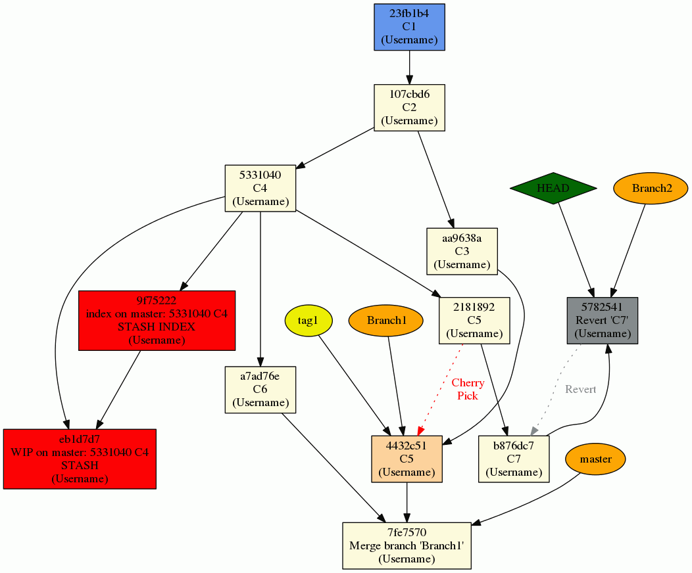

# git-graph

Tool to create a graph from a git history showing tags, branches, stash nodes, cherry-picks.

## Requirements

* Python3
* Graphiz

## Create a graph

Run the following inside a git directory to write a graph description to stdout.

    ./git-graph

On linux you can use the following command to crate a graph.ps file

    ./git-graph | dot -Tps -o graph.ps

Example with range

    ./git-graph -r a51eced..HEAD | dot -Tps -o graph.ps

### Parameters
* **-x**: to print debug output to stderr
* **-r range**: to get a specific range of the repository. See [here](http://git-scm.com/book/en/Git-Tools-Revision-Selection#Commit-Ranges)

# Example Graph

